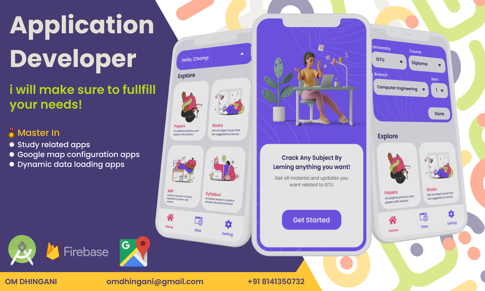

<h1 align="center">Hello 👋, I'm Om Dhingani</h1>

### About me

* 🌍  I'm based in Gujarat, India
* 🖥️  Highly Skilled In Android App Developement and JAVA. 
* ✉️  You can contact me at [omdhingani0@gmail.com](mailto:omdhingani0@gmail.com)
* 🤝  I'm open to collaborating on Real World Projects

---

  

---
### Skills

  

---
### Socials

  

---
### My GitHub Stats

 

---

## Thank You!!

